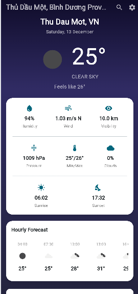
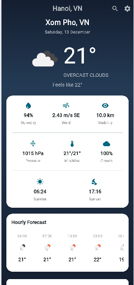
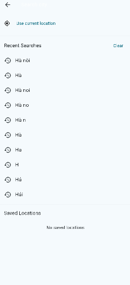
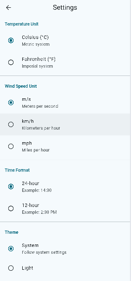
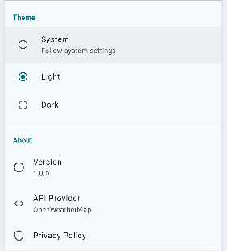

🌤️ Weather App - Ứng Dụng Thời Tiết Flutter
Một ứng dụng thời tiết đẹp mắt, đầy đủ tính năng được xây dựng bằng Flutter cung cấp thông tin thời tiết thời gian thực, dự báo và hỗ trợ đa ngôn ngữ.

📱 Tính Năng
🌟 Tính Năng Chính
Hiển thị thời tiết hiện tại

Nhiệt độ với cảm giác thực tế
Điều kiện thời tiết với biểu tượng
Tên thành phố và quốc gia
Ngày và giờ hiện tại
Mô tả thời tiết
Chi tiết thời tiết

Độ ẩm (%)
Tốc độ gió (m/s, km/h, mph)
Áp suất (hPa)
Tầm nhìn (km)
Mặt trời mọc/lặn
Chỉ số UV (nếu có)
Dự báo thời tiết

Dự báo theo giờ (24 giờ tiếp theo)
Dự báo hàng ngày (5-7 ngày)
Nhiệt độ tối thiểu/tối đa
Xác suất mưa
Tìm kiếm thành phố

Tìm kiếm theo tên thành phố
Lịch sử tìm kiếm
Thành phố yêu thích (lưu tối đa 5 thành phố)
Dịch vụ định vị

Tự động phát hiện vị trí
Chọn vị trí thủ công
Xử lý quyền truy cập vị trí
Hỗ trợ ngoại tuyến

Lưu cache dữ liệu cuối cùng
Hiển thị dữ liệu đã cache khi offline
Chỉ báo khi đang dùng dữ liệu cache
Cài đặt

Đơn vị nhiệt độ (Celsius/Fahrenheit)
Đơn vị tốc độ gió (km/h, m/s, mph)
Định dạng thời gian (12/24 giờ)
🎨 Thiết kế UI/UX
Giao diện động thay đổi theo điều kiện thời tiết
Gradient nền khác nhau cho từng loại thời tiết
Hiệu ứng loading shimmer
Pull-to-refresh để cập nhật dữ liệu
Responsive design cho nhiều kích thước màn hình
🏗️ Kiến Trúc Dự Án
lib/
│   main.dart
│   
├───config
│       api_config.dart
│       
├───models
│       forecast_model.dart      
│       hourly_weather_model.dart
│       location_model.dart      
│       weather_model.dart       
│
├───providers
│       location_provider.dart
│       settings_provider.dart
│       weather_provider.dart
│       
├───screens
│       forecast_screen.dart
│       home_screen.dart
│       search_screen.dart
│       settings_screen.dart
│       
├───services
│       connectivity_service.dart
│       language_service.dart
│       location_service.dart
│       storage_service.dart
│       weather_service.dart
│       
├───utils
│       constants.dart
│       date_formatter.dart
│       weather_icons.dart
│       
└───widgets
        current_weather_card.dart
        daily_forecast_card.dart
        error_widget.dart
        hourly_forecast_list.dart
        loading_shimmer.dart
        weather_detail_item.dart

        Trang chủ:
        chứa địa chỉ, nhiệt độ, tốc độ gió, độ ẩm,vv
        

        Tìm kiếm: HaNoi không vội được đâu
        
        

        Sting :
        

        # weather_app
